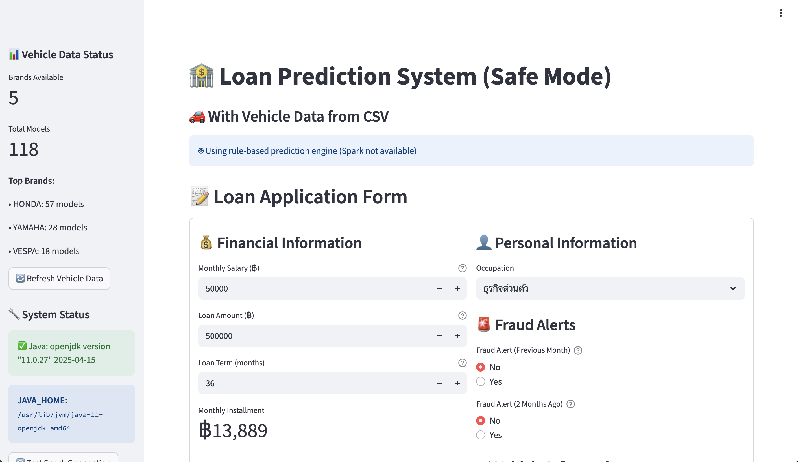
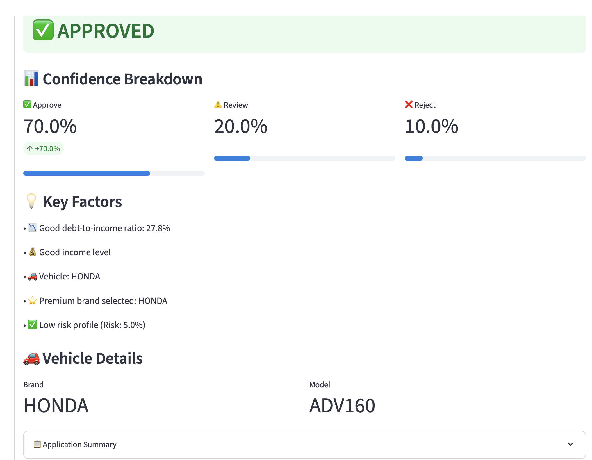

# Loan Prediction System (Safe Mode)

ระบบทำนายผลการอนุมัติสินเชื่อ พร้อมฟีเจอร์เลือกยี่ห้อและรุ่นรถจากไฟล์ CSV  
**โหมดปลอดภัย:** ใช้ rule-based engine หาก Spark ใช้งานไม่ได้

## คุณสมบัติ

- ฟอร์มกรอกข้อมูลขอสินเชื่อ (เงินเดือน, วงเงิน, ระยะเวลา, อาชีพ, สถานะ Fraud, ยี่ห้อ/รุ่นรถ)
- ดึงข้อมูลยี่ห้อและรุ่นรถจากไฟล์ `Book1.csv`
- แสดงผลการทำนาย (อนุมัติ/รอตรวจสอบ/ปฏิเสธ) พร้อมคะแนนความมั่นใจ
- วิเคราะห์ปัจจัยสำคัญที่มีผลต่อการอนุมัติ
- รองรับทั้ง Spark และ rule-based engine

## การติดตั้ง

1. ติดตั้ง Python 3.8+ และ [pip](https://pip.pypa.io/en/stable/)
2. ติดตั้งไลบรารีที่จำเป็น

```sh
pip install -r requirements.txt
```
3. วางไฟล์ Book1.csv (ต้องมีคอลัมน์ Brand, Model_Name) ไว้ในโฟลเดอร์เดียวกับแอป
## การใช้งาน
รันแอปด้วย Streamlit:

```sh
streamlit run minimal_app.py
```

เปิดเบราว์เซอร์ที่ http://localhost:8501

## โครงสร้างไฟล์
- minimal_app.py — โค้ดหลักของแอป
- Book1.csv — ไฟล์ข้อมูลยี่ห้อและรุ่นรถ
- requirements.txt — รายการไลบรารีที่ต้องติดตั้ง

## หมายเหตุ
- หากไม่มี Java หรือ Spark ใช้งานไม่ได้ แอปจะใช้ rule-based engine อัตโนมัติ
- สามารถรีเฟรชข้อมูลรถยนต์หรือทดสอบ Spark ได้จาก sidebar
- หากไม่มีไฟล์ Book1.csv จะใช้ข้อมูลตัวอย่างแทน

## Screen short




## License
MIT